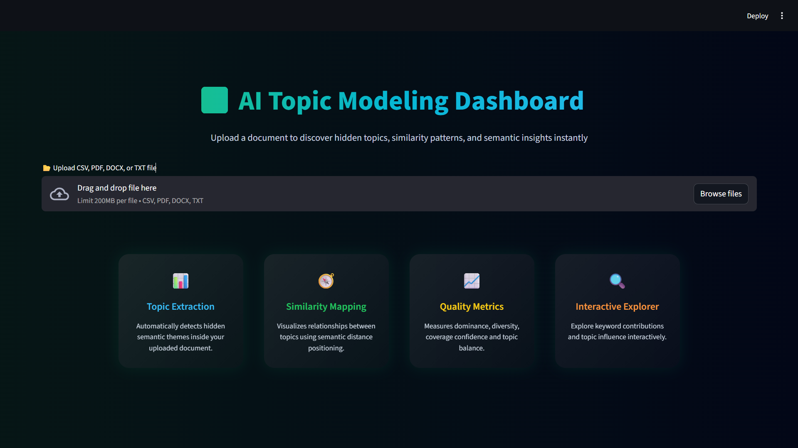
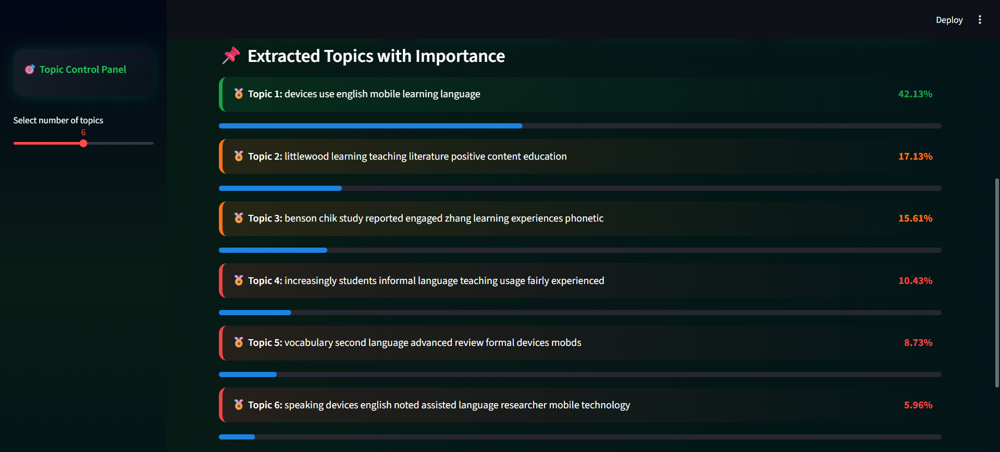
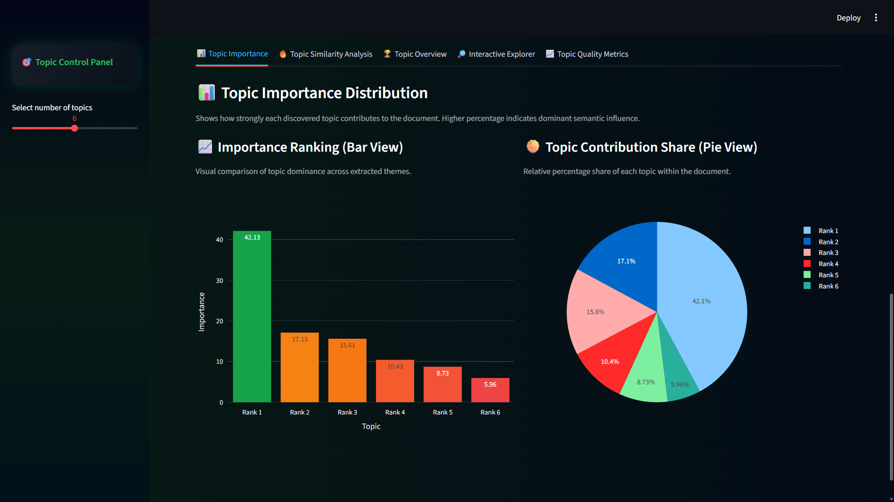
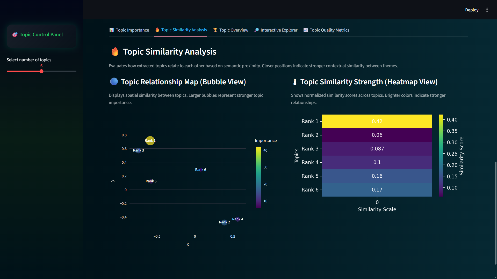
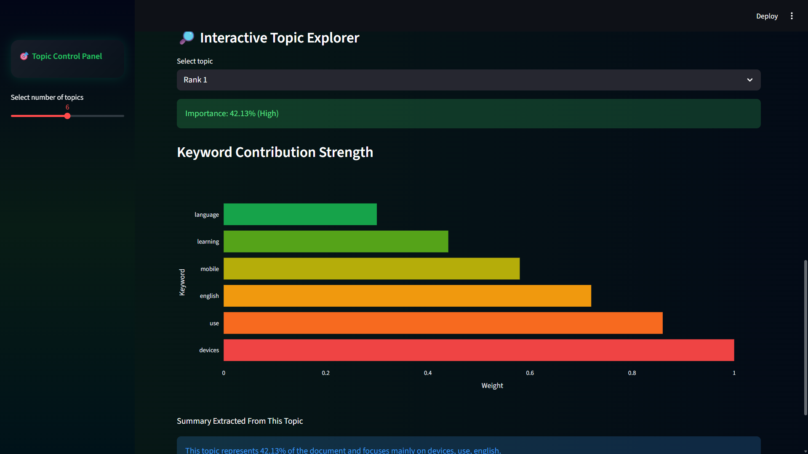
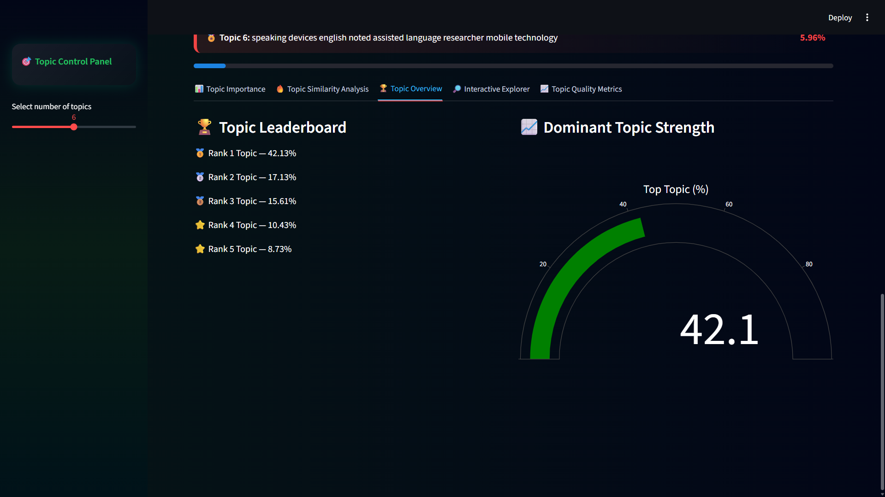
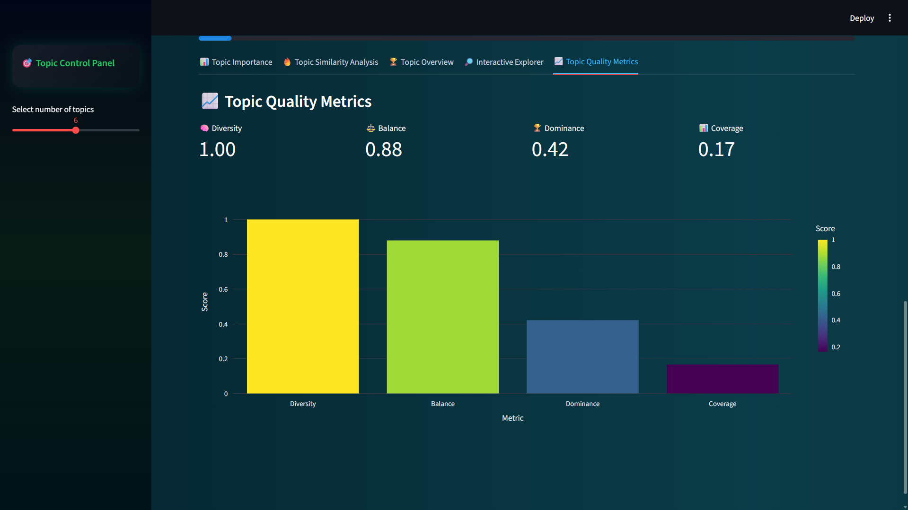

# 📊 AI Topic Modeling Dashboard

An interactive NLP-based web application that extracts meaningful topics from customer feedback, research reports, and documents using Topic Modeling techniques.

## 🚀 Features

- Upload PDF, DOCX, TXT, CSV files
- Automatic topic extraction using NMF / LDA
- Topic importance visualization
- Topic similarity heatmap
- Interactive keyword explorer
- Executive summary generation
- Supports long reports (10+ pages)

## 🎯 Objective

Apply topic modeling to analyze customer feedback at scale.

Optimization Objective:
Maximize topic diversity and coherence.

Success Criterion:
Generate actionable insights for decision-making.

## 🧠 Technologies Used

- Python
- Streamlit
- Scikit-learn
- TF-IDF Vectorizer
- NMF / LDA Topic Modeling
- Plotly Visualization
- Matplotlib & Seaborn
- NLTK (Text preprocessing)

## 📂 Supported File Formats

- PDF
- DOCX
- TXT
- CSV

## ▶️ How to Run the Project

Install dependencies:

pip install -r requirements.txt

Run application:

streamlit run app.py

Live project Link:
Demo: https:ai-topic-modeling-dashboard-dbggv7nnz9jgod3txss6dm.streamlit.app/

## 📸 Dashboard Preview
1.Upload Interface
    

2.Extracted Topics with Importance
    

3.Topic Importance Graph
    

4.Topic Similarity Analysis
    

5.Interactive Topic Explorer
    

6.Topic Leaderboard
    

7.Topic Quality Matrics
    

## 👨‍💻 Developed For

Optimization Techniques for Machine Learning Project
